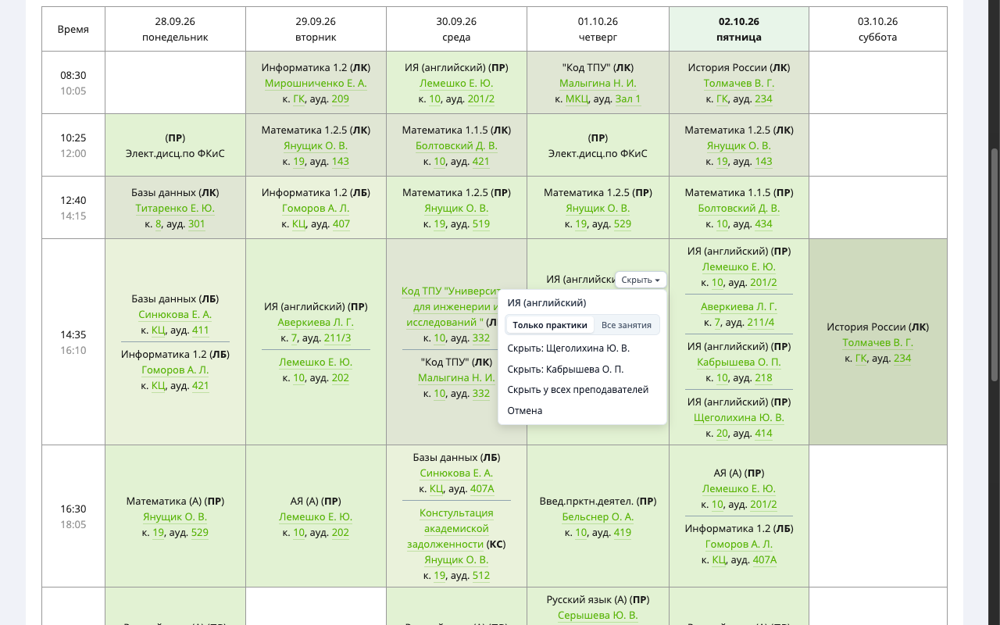
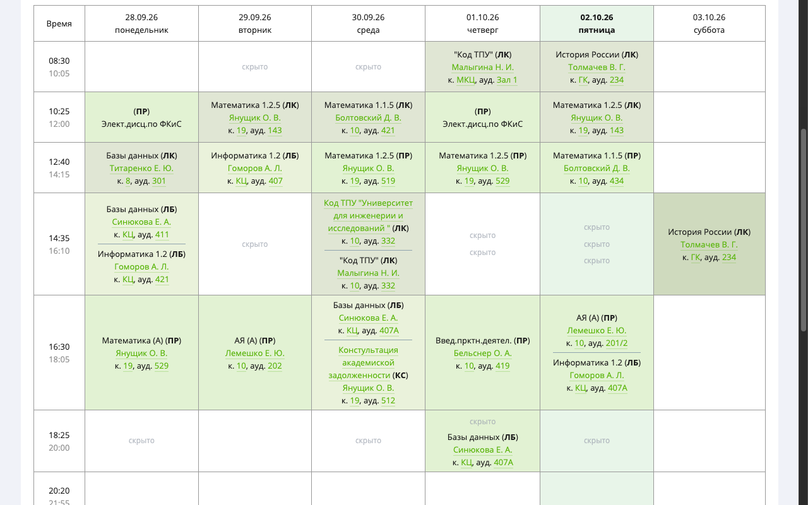
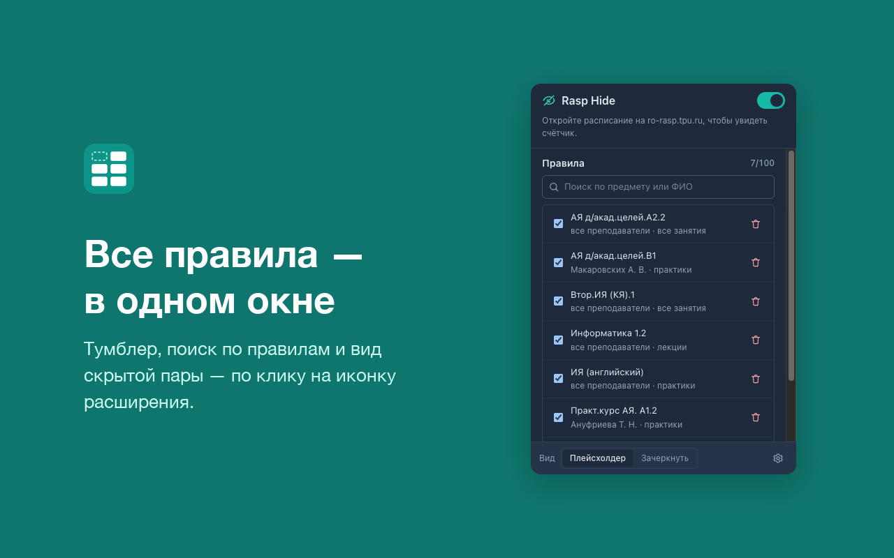
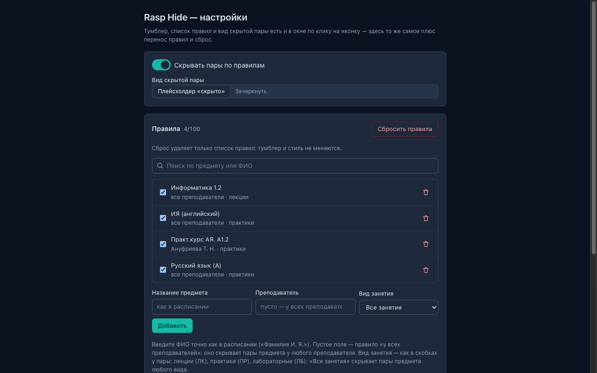

# Rasp Hide

Браузерное расширение (MV3) для скрытия пар в расписании ТПУ на [ro-rasp.tpu.ru](https://ro-rasp.tpu.ru).
Работает в Chrome, Firefox, Edge, Opera и других браузерах на Chromium (Яндекс Браузер, Brave, Vivaldi).

Rasp Hide убирает из расписания пары, на которые вы не ходите: например, факультативные
дисциплины, которые вы не выбирали.

Скрывать можно **любые** пары — по предмету, преподавателю и виду занятия (лекции, практики,
лабораторные) в любом сочетании.

## Возможности

- **Скрытие по клику**: наведите курсор на пару → кнопка «Скрыть» → выберите «у этого преподавателя» или «у всех преподавателей».
- **Лекции отдельно от практик**: в меню — «Только лекции | Все занятия» (по виду пары под курсором);
  по умолчанию скрывается только этот вид, практика того же предмета остаётся.
- **Поблочное скрытие**: у пары с несколькими преподавателями можно скрыть блок только одного из них.
- **Плейсхолдер**: на месте скрытой пары — бледная пометка «скрыто»; наведите курсор → «Вернуть».
  Если пару скрывают сразу несколько правил, «Вернуть» сначала покажет, какие удалятся.
- Клетка, где скрыты все пары, выглядит как пустая — в том числе сохраняет подсветку текущего дня.
- **Стиль скрытия**: «плейсхолдер» или «зачеркнуть» (глобальная настройка).
- **Полная страница настроек**: всё то же плюс экспорт/импорт правил, сброс
  и очистка подсказок. Тёмная тема — по настройке системы, и в окне, и на странице.
- **Окно по клику на иконку**: тумблер, что скрыто на этой вкладке, список правил
  с поиском, добавление вручную и вид скрытой пары. Выключение и с клавиатуры —
  `Alt+Shift+H` (переназначается на `chrome://extensions/shortcuts`, в Firefox —
  `about:addons` → шестерёнка → «Управление горячими клавишами»).
- Бейдж на иконке — per-tab: зелёное число скрытых пар, серый «OFF».
- **Работает на всех страницах сайта с расписанием** (группа, преподаватель, аудитория), включая архивы.
- Правила синхронизируются между устройствами через `chrome.storage.sync` — учётной
  записью того браузера, где стоит расширение.
- **Экспорт и импорт правил** в JSON: файл можно сохранить на диск и перенести
  в другой профиль или браузер (слияние или замена набора, с подтверждением).

## Скриншоты









## Матчинг

- Точное совпадение **видимого** короткого названия предмета (подгруппы различаются: `АЯ д/акад.целей.A1.1` ≠ `АЯ д/акад.целей.B1`).
- Перед сравнением текст нормализуется (пробелы, `&nbsp;`).
- Пары без названия предмета (ОВ, ОС и т.п.) скрытию не подлежат.
- Вид занятия — видимая пометка пары `(ЛК)`, `(ПР)`, `(ЛБ)`; правило без вида — «все занятия».
- Инварианты правил: дубликаты запрещены, более широкое правило поглощает покрытые им
  (с подтверждением), уже покрытое не добавляется, лимит 100.

## Установка

Из магазина своего браузера: Chrome Web Store (он же — для Яндекс Браузера, Brave, Vivaldi),
Firefox Add-ons, Edge Add-ons, Opera Add-ons. Пакет везде один и тот же. Мобильные
браузеры и Safari не поддерживаются.

### Режим разработчика

1. Скачайте репозиторий (`Code → Download ZIP` или `git clone`).
2. Chrome, Edge, Opera, Яндекс Браузер: откройте `chrome://extensions`, включите
   **Режим разработчика** → «Загрузить распакованное расширение» → папка репозитория.
3. Firefox (140+): `about:debugging` → «Этот Firefox» → «Загрузить временное дополнение» →
   файл `manifest.json` (или `npx web-ext run --source-dir .`).
4. Откройте расписание на ro-rasp.tpu.ru.

## Использование

1. Наведите курсор на пару → появится кнопка **«Скрыть»**.
2. В мини-меню выберите вид (**«Только лекции»** или **«Все занятия»**), затем:
   - **«Скрыть: ФИО»** — только у этого преподавателя (если в паре несколько);
   - **«Скрыть у всех преподавателей»** — по названию пары;
   - **«Отмена»**.
   Меню закрывается само примерно через секунду после того, как курсор ушёл из клетки.
3. Скрытая пара заменяется плейсхолдером; наведите на него → **«Вернуть»**.
4. Клик по иконке расширения — окно с тумблером и списком правил. Тумблер
   в одно движение — `Alt+Shift+H`.
5. Кнопка-шестерёнка в окне открывает полную страницу настроек: там сброс правил,
   очистка подсказок и перенос правил между профилями.
6. При ручном вводе правила поля предлагают названия и ФИО, встреченные на открытых
   страницах расписания.
7. «Скачать JSON» и «Загрузить из файла…» — перенос правил.
   Без галочки «Заменить текущие правила» набор из файла добавляется к текущему;
   дубликаты и уже покрытые правила пропускаются, а если импорт что-то удаляет —
   сначала показывается сводка с подтверждением.

## Разработка

```bash
npm test       # 9 наборов: matcher, rules, content, background, options, suggestions, ui, popup, manifest
npm run pack   # архив для магазинов (один на все браузеры): dist/rasp-hide-<версия>.zip
```

Тексты и чек-лист для публикации — [docs/STORE_LISTING.md](docs/STORE_LISTING.md)
и [docs/STORE_CHECKLIST.md](docs/STORE_CHECKLIST.md); картинки для витрины (скриншоты,
промо, исходник логотипа) — в `store/`, в пакет расширения они не входят.

Структура и схема DOM сайта описаны в [docs/ARCHITECTURE.md](docs/ARCHITECTURE.md),
требования — в [docs/REQUIREMENTS.md](docs/REQUIREMENTS.md), процесс — в [docs/PLAN.md](docs/PLAN.md).

## Приватность

Расширение **не собирает и не отправляет** никакие данные. Сеть не используется.
Экспорт формирует файл локально, в браузере: никуда не загружается.

В хранилище лежит только это:

- `chrome.storage.sync` — настройки: правила, тумблер, стиль скрытия (переносятся
  между устройствами штатной синхронизацией браузера; правила лежат частями в ключах
  `rules`, `rules_1`…`rules_3` — в один ключ сотня правил не помещается);
- `chrome.storage.local` — подсказки для ручного ввода: названия предметов и ФИО,
  встреченные на открытых страницах расписания. Не синхронизируются, никуда
  не отправляются, стираются кнопкой «Очистить подсказки» в настройках.

Полный текст — [PRIVACY.md](PRIVACY.md).

## Лицензия

[MIT](LICENSE)
